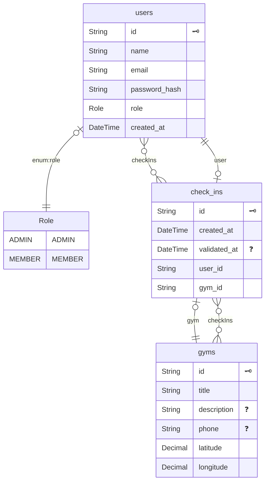

```mermaid
erDiagram

        Role {
            ADMIN ADMIN
MEMBER MEMBER
        }
    
  "users" {
    String id "🗝️"
    String name 
    String email 
    String password_hash 
    Role role 
    DateTime created_at 
    }
  

  "check_ins" {
    String id "🗝️"
    DateTime created_at 
    DateTime validated_at "❓"
    String user_id 
    String gym_id 
    }
  

  "gyms" {
    String id "🗝️"
    String title 
    String description "❓"
    String phone "❓"
    Decimal latitude 
    Decimal longitude 
    }
  
    "users" o|--|| "Role" : "enum:role"
    "users" o{--}o "check_ins" : "checkIns"
    "check_ins" o|--|| "users" : "user"
    "check_ins" o|--|| "gyms" : "gym"
    "gyms" o{--}o "check_ins" : "checkIns"
```
